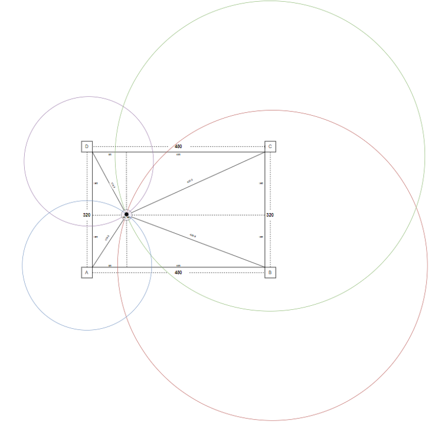
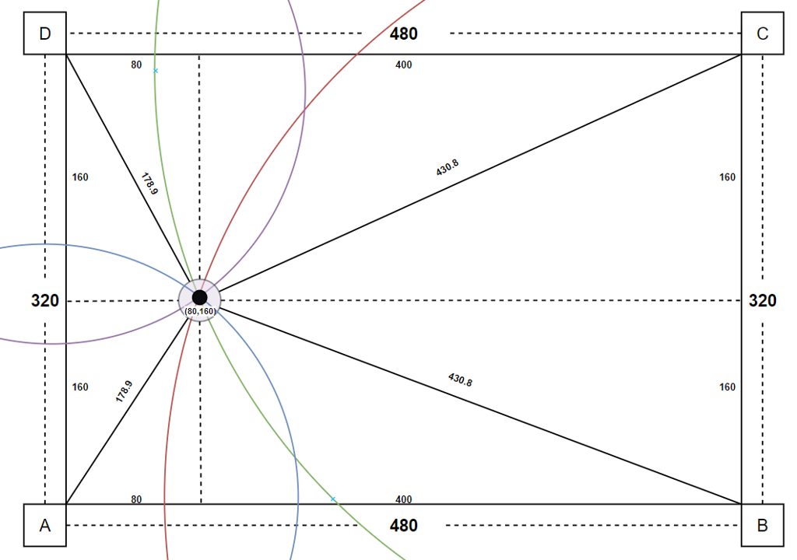
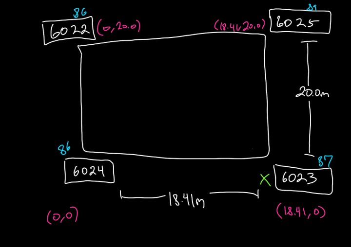

# Overview
The ultrawideband app collects data from 4 UWB sensors (anchors) ([product page](https://www.makerfabs.com/esp32-uwb-ultra-wideband.html), [github page](https://github.com/Makerfabs/Makerfabs-ESP32-UWB)), which display the following information:
* anchor ID
* distance in meters to the tag (on the car)
* power of the anchor
# Calculating the car's coordinates
The distance data mentioned above is collected and used to calculate an (x, y) coordinate for the car. As an example, consider the following:
* We have a room that is 480m long and 320m wide
* There are four UWB anchor set up in the room, on in each corner
* There is a car located somewhere within this room
* The car is collecting data on the straight-line distance between itself and each anchor
* The coordinates of each anchor are as follows:
	* A: (0, 0)
	* B: (480, 0)
	* C: (480, 320)
	* D: (0, 320)

Given all of the above, we can use trilateration to calculate the (x, y) coordinates of the car. Trilateration is similar to the principle of triangulation, just using distances instead of angles. It is also the method used by GPS to calculate your location!

In essence, trilateration is just a way of determining where the intersection of 3 or more shapes is. In our case, since we are working in a 2D world, that would be the intersection of 3 circles. However, since we have 4 anchors, we will instead be finding the intersection of 4 circles, with the extra datapoint serving as a way to increase the robustness of our calculation. 

The following diagram visualizes the above example:

The same principle is used in our real-world use-case within 99p labs. The following is a diagram of that setup:

The anchor IDs are 6024, 6023, 6025, and 6022. We are treating the bottom left anchor (6024) as (0, 0), and the rest of the coordinates are based off of this starting point.

The max(x) and max(y) coordinates are determined by calculating the physical distance between the anchors, resulting in a max(x) of 18.41m and max(y) of 20.0m.

Therefore, the car's location within this coordinate plane should always be between (0, 0) and (18.41, 20.0). 

Once again, we collect the distance between the car and each of the anchor, and use that to find the intersection of four circles. Unlike the simple example used above, however, the actual `uwb.py` code uses `scipy's` `minimize` function to find the best guess for (x, y). This is because the actual data coming from the sensors is noisy and can be affected by occlusion.
