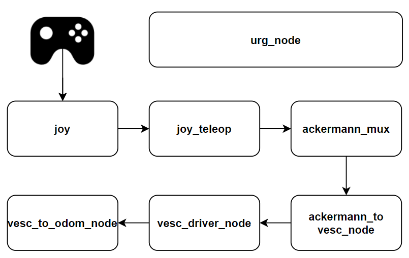

# High Level Overview
The `base container` is responsible for all communication between driving hardware (VESC, motors, etc.) and software. There are many moving parts with complicated interdependencies, but it is not important to understand every detail of how `base` works. However, it is important to have a high level understanding of the components, what each one is responsible for, and how they interact.

# Setup Considerations

## Tuning the Odometry
It's important to tune the odometry by following [this guide](https://mushr.io/tutorials/tuning/). You should only have to do this once as the beginning and then again only if you notice things getting very out of alignment. 

## Setting the Speed
You can change the top speed of the car by editing the `speed_max` value in the `vesc.yaml` file located in `base`'s `/f1tenth_system/f1tenth_stack/config/` directory.

## Deadman Switch 
You can change the button that is used as the deadman switch by editing the `deadman buttons` value in the `joy_teleop.yaml` file located in `base`'s `/f1tenth_system/f1tenth_stack/config/` directory.

# Node Explanations

## Overall Flow

## joy
***Responsibility:*** Reads input from a joystick device and publishes the joystick state as a ROS message (`sensor_msgs/Joy`). It handles the raw joystick inputs, like button presses and analog stick positions.
***Interaction:*** Interacts with the physical joystick hardware, capturing user input, and then sends this data to the `joy_teleop` node, which interprets the joystick commands for vehicle control.

## joy_teleop
***Responsibility:*** Converts joystick inputs (from the `joy` node) into Ackermann drive commands. It maps joystick buttons and axes to control the vehicle’s speed and steering.
***Interaction:*** Listens to joystick input from the `joy` node, converts the data into Ackermann drive messages, and sends these messages to the `ackermann_mux` node for possible selection as the active control command.

## ackermann_mux
***Responsibility:*** Multiplexes several potential control inputs (joystick, autonomous planner, or keyboard teleoperation) and selects which command to send to the vehicle.
***Interaction:*** Takes in control commands from different sources (such as the `joy_teleop` node for manual control or autonomous navigation commands) and outputs a single Ackermann command. This command is forwarded to the `ackermann_to_vesc_node` for conversion into motor and steering commands that the VESC can understand.

## ackermann_to_vesc_node
***Responsibility:*** Converts Ackermann drive commands (steering angle and velocity) into appropriate motor and steering signals that can be interpreted by the VESC.
***Interaction:*** Receives the high-level Ackermann commands from the `ackermann_mux` node and translates them into VESC-compatible control signals. These are then sent to the `vesc_driver_node` to actuate the vehicle.

## vesc_driver_node
***Responsibility:*** Directly interfaces with the VESC motor controller. It sends motor and steering commands to the VESC and receives feedback such as speed, current, and telemetry data.
***Interaction:*** Interacts with the VESC hardware, sending commands from the `ackermann_to_vesc_nod`e to control the vehicle's motor and steering. Additionally, it gathers telemetry from the VESC, which is passed to the `vesc_to_odom_node` for further processing.

## vesc_to_odom_node
***Responsibility:*** Converts telemetry data from the VESC (wheel speeds, steering angle) into odometry information that can be used by other ROS nodes for localization and navigation.
***Interaction:*** Listens to telemetry data from the `vesc_driver_node` and converts it into a ROS odometry message. This odometry message is published and used by other subsystems like SLAM or navigation to track the robot's movement.

## urg_node
***Responsibility:*** Directly interfaces with a Hokuyo LiDAR. It collects laser scan data and publishes it as a `sensor_msgs/LaserScan` message in ROS.
***Interaction:*** Broadcasts the laser scan to be used for things like mapping, collision avoidance, navigation, and more.