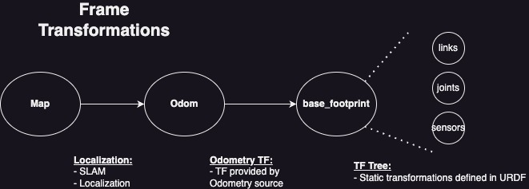

#### Prerequisites
This package is confirmed to work properly on the ROS humble distribution.

Before diving into the navigation setup, it's important to ensure that your vehicle has implementations for the following:

1. **2D Lidar:** This sensor is crucial for detecting obstacles and mapping the environment. It should be publishing data LaserScan messages to the `/scan` topic.

2. **Odometry:** Odometry data, which provides information about the vehicle's movement, should be publishing Odometry messages to the `/odom` topic.
    
3. **Vehicle Transformation Tree:** The vehicle's transformation tree (tf tree) should be correctly set up to ensure proper coordinate transformations between the different parts of the robot.
   

#### Localization and Mapping

For a vehicle to navigate autonomously, it needs to know where it is within a given environment. This is where localization and mapping come into play.

- **Adaptive Monte Carlo Localization (AMCL):**
    
    - AMCL is a probabilistic method used to determine the vehicle's position on a pre-existing map. We utilized the `nav2_amcl` package, which allows the vehicle to localize itself by comparing its sensor data to the known map. You can learn more about configuring AMCL [here](https://docs.nav2.org/configuration/packages/configuring-amcl.html).
- **SLAM (Simultaneous Localization and Mapping):**
    
    - If your vehicle is exploring an unknown environment, SLAM can help it build a map while simultaneously determining its position within that map. The `slam_toolbox` is a powerful tool that we used to achieve this.
#### Path Planning

Once the vehicle knows where it is, the next step is planning a path to its destination.

- **SmacHybridPlanner:**
    - For our path planning needs, we used the `SmacHybridPlanner`. This planner is highly adaptable, capable of handling both 2D and 3D spaces, and is especially useful for vehicles navigating complex environments. More details on configuring the SmacHybridPlanner can be found [here](https://docs.nav2.org/configuration/packages/smac/configuring-smac-hybrid.html).

#### Control

After planning a path, the vehicle needs to follow it accurately. This is where the controller comes in.

- **Regulated Pure Pursuit:**
    - We opted for the `Regulated Pure Pursuit` controller, which is a method that ensures the vehicle follows the planned path smoothly and efficiently. It adjusts the vehicle's speed based on the curvature of the path and the proximity of obstacles. Configuration details can be found [here](https://docs.nav2.org/configuration/packages/configuring-regulated-pp.html).

#### Bringing It All Together: The `car_navigation` Package

To simplify the process of launching and managing these components, we created a custom package called `car_navigation`.  This package is meant for 4 wheeled non-holonomic vehicles to navigate autonomously.

Here’s how you can use it:

- **Launch Files:**
    - The main entry point for our navigation setup is through a launch file. To start everything up, you can run the following command:
        `ros2 launch car_navigation bringup_launch.py`
        
- **Launch Parameters:**
    - The launch file can be customized using several parameters:
        - `slam`: Set this to `True` if you want to use SLAM; otherwise, set it to `False`.
        - `use_amcl`: Set this to `True` if you are using a pre-existing map with AMCL. If set to `False` , the vehicle will use slam_toolbox's localization node to localize the vehicle.
        - `use_composition`: This parameter allows you to run multiple nodes in a single process to improve efficiency. Set this to `True` if you wish to use dynamic composition and `False` if not.
        - `params_file`: Specify the path to your configuration file (YAML format) that includes parameters for the navigation stack.
        - `map`: Provide the path to the map file (if not using SLAM). The path should refer to a yaml file with the correct corresponding pgm file.

### Further Customization
An important thing to remember is that almost everything in this setup is built in a modular fashion.  As long as you satisfy some of the basic requirements, you are able to entirely substitute in and out pieces that better fit your wants and needs. For example if you have access to a camera for the vehicle, and you want to use the camera to supplement the creation of a map, you are able to do so. If you want to use a different localization method instead of the ones used by default in this package then feel free! Our advice would be to understand each step of the autonomous driving process and identify what the current part is subscribed and published to and then make sure your new piece accomplishes the same task.

### Conclusion

Setting up autonomous navigation for a vehicle involves several components, from sensors to perception, planning, and control.  With the `car_navigation` package, our team was able to create a robust and flexible navigation system that can adapt to different environments and scenarios.

Resources:
https://github.com/zhm-real/PathPlanning
https://theory.stanford.edu/~amitp/GameProgramming/AStarComparison.html
https://medium.com/@junbs95/gentle-introduction-to-hybrid-a-star-9ce93c0d7869
https://en.wikipedia.org/wiki/Dubins_path
https://www.roboticsbook.org/S55_diffdrive_planning.html
https://github.com/ai-winter/ros_motion_planning?tab=readme-ov-file

Blog Post:
https://medium.com/99p-labs/project-somethings-creating-a-cyber-physical-environment-for-the-future-of-mobility-979a1b9c4e55#23f1
